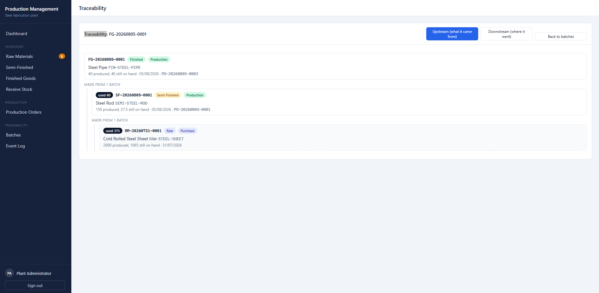
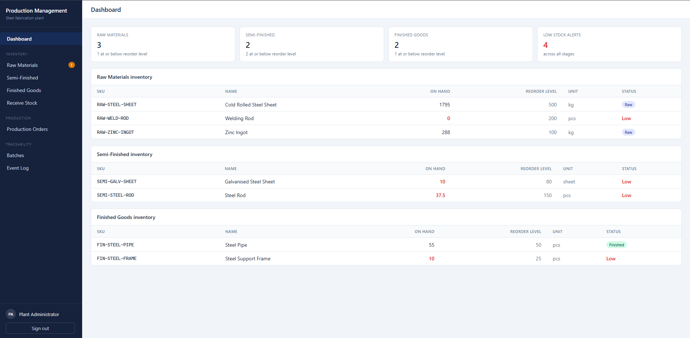
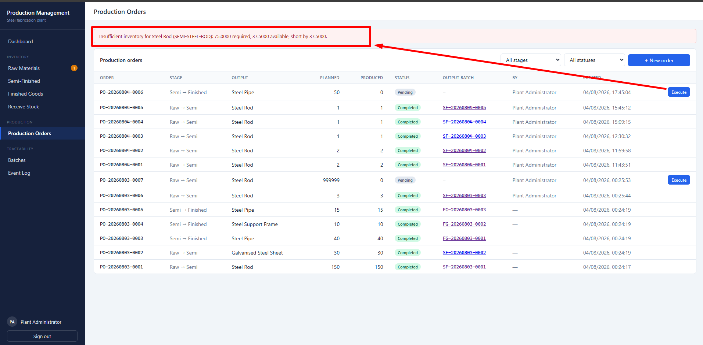
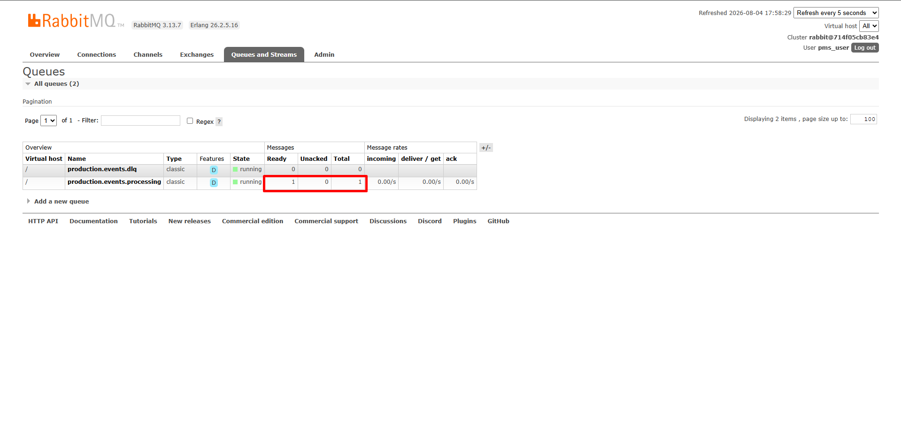

# Production Management System

A backend for a steel fabrication plant. Raw materials come in, get turned into
semi-finished parts, and those become finished goods. Every batch can be traced
back to the exact raw material it came from.

Laravel 12 · MySQL 8 · RabbitMQ 3 · React · Docker Compose

---

## Screenshots

**Traceability.** One finished batch, traced back through the semi-finished
batch to the raw steel it started as.



**Dashboard.** Each stage keeps its own inventory.



**Production is blocked when stock is short.** The order is not created and no
stock moves.



**RabbitMQ.** A real topic exchange, a bound work queue, and a dead letter queue.



---

## Quick start

You need Docker. Nothing else.

```bash
git clone <repo-url>
cd production-management-system
docker compose up -d
```

That one command builds the image, waits for MySQL and RabbitMQ, installs
dependencies, runs migrations and seeders, then starts the API, the queue
worker, and the React UI.

First boot takes a couple of minutes because of `composer install`. Watch it
with `docker compose logs -f app`.

| What | Where | Login |
|---|---|---|
| Admin UI | http://localhost:5173 | `admin@pms.test` / `password` |
| API | http://localhost:8001/api/v1 | bearer token from `/auth/login` |
| RabbitMQ console | http://localhost:15672 | `pms_user` / `pms_secret` |
| MySQL | `localhost:3307` | `pms_user` / `pms_secret` |

The seeder does not just insert rows. It runs a real two stage production chain
through the actual services, so a broken service shows up as a failed seed.

To start over: `docker compose down -v && docker compose up -d`

---

## Try it in two minutes

Import `postman_collection.json` into Postman, or use curl. Run **Login**
first; the collection saves the token for every other request.

```bash
API=http://localhost:8001/api/v1
TOKEN=$(curl -s -X POST $API/auth/login -H 'Content-Type: application/json' \
  -d '{"email":"admin@pms.test","password":"password"}' | jq -r .data.token)
AUTH="Authorization: Bearer $TOKEN"
```

| Step | Call | What you should see |
|---|---|---|
| 1 | `GET /inventory` | 7 items across three stages, each with its own quantity |
| 2 | `GET /items/4/recipe` | what one Steel Rod needs |
| 3 | `POST /production-orders` | order created, status `pending`, **stock has not moved** |
| 4 | `POST /production-orders/{id}/execute` | now stock moves and a batch appears |
| 5 | `GET /inventory` again | inputs went down, output went up |
| 6 | `GET /batches/{id}/trace` | the full chain back to raw material |
| 7 | `POST .../execute` again | **409**. An order runs once |
| 8 | `POST /production-orders` with a huge quantity, then execute | **422** with the shortfall, and nothing written |
| 9 | `GET /production-events` | a row that RabbitMQ delivered a moment ago |

Steps 7 and 8 are the interesting ones. They are what stops the same order
being run twice, and what stops production when stock is short.

---

## What it does

| The assignment asks for | Where it lives |
|---|---|
| Raw → semi-finished → finished workflow | `ProductionService::execute()` |
| Independent inventory per stage | one `items` table with a `type`, one stock row per item |
| Batches with number, quantity, timestamp | `batches` table, numbers like `RM-20260803-0001` |
| Which raw materials went into each batch | `production_consumptions`, one row per input batch |
| Deduct inputs, add outputs | same transaction as the order, `ProductionService` |
| Block production when stock is short | `InventoryAllocator`, inside a row lock |
| Trace finished → semi → raw | `TraceabilityService`, walks the graph recursively |
| CRUD for all three product types | three REST resources, one shared controller |
| Current inventory | `GET /inventory`, `GET /inventory/stage/{stage}` |
| Batch history and traceability API | `GET /batches`, `/trace`, `/trace-downstream` |
| Publish on both transitions | one event, both stages, `ProductionCompleted` |
| A separate consumer doing real work | `worker` container running `queue:work rabbitmq` |
| Compose with app, MySQL, RabbitMQ, worker | `docker-compose.yml` |
| Migrations and seeders | `database/migrations`, `database/seeders` |
| React admin UI | `frontend/` |

---

## How it fits together

### The folders

```
app/Http/Requests/      what is allowed in (validation)
app/Http/Controllers/   translates HTTP to a service call, no rules here
app/Services/           all the business rules, all the transactions
app/Repositories/       all the queries, no SQL anywhere else
app/Models/             tables, relations, casts
app/Http/Resources/     what goes out (the JSON shape)
app/Enums/              fixed values and the rules attached to them
app/Jobs, app/Listeners the async path
```

### A simple request, start to finish

`GET /raw-materials?search=steel`

```
routes/api.php                    finds the route
  ItemFilterRequest               checks search, is_active, per_page
  RawMaterialController::index    says "I am the raw material resource"
    ItemService::list             passes the filters down
      ItemRepository              builds and runs the query
        ItemModel                 the items table
  ItemResource                    turns each row into JSON
```

Six files, each with one job. Read them in that order and the whole codebase
makes sense.

### The interesting request

`POST /production-orders/{id}/execute`

Start at `routes/api.php`, then follow this:

**1. `ProductionOrderController::execute()`**
Four lines. It finds the order, calls the service, returns a resource. No rules
live here.

**2. `ProductionService::execute()`**
Everything below runs inside one `DB::transaction`, so the order either
completes fully or leaves no trace.

**3. `lockPendingOrder()`**
Reads the order again with `SELECT ... FOR UPDATE` and checks it is still
pending. The caller's copy may be stale. This is what turns a second execute
call into a 409 instead of a second stock deduction.

**4. `allocateInputs()` → `InventoryAllocator`**
Works out which batches cover each input, oldest first (FIFO). Nothing is
written yet. If any input is short it throws here and the whole transaction
rolls back, so an order can never consume half its inputs.

**5. `consumeInputs()`**
Now it writes. For each batch it takes from: a consumption row (this is the
traceability edge), a smaller `quantity_remaining`, and a ledger row.

**6. `produceOutput()` → `BatchService::make()`**
Creates the output batch with a unique number, adds the quantity to stock,
writes the matching ledger row.

**7. `ProductionCompleted::dispatch()`**
Fires after the transaction commits, never inside it.

**8. `PublishProductionCompleted` → `RecordProductionCompleted`**
The listener queues a job. The job runs in the `worker` container, not in the
request. It writes the row you see at `GET /production-events`.

**9. `ProductionOrderResource`**
Shapes the JSON that goes back.

---

## API reference

Everything lives under `/api/v1`. Every route except login needs
`Authorization: Bearer <token>`.

### Auth

| Method | Path | |
|---|---|---|
| POST | `/auth/login` | returns a token |
| POST | `/auth/logout` | revokes it |
| GET | `/auth/me` | current user |

### Products

The same five routes exist for `raw-materials`, `semi-finished-products` and
`finished-products`.

| Method | Path | |
|---|---|---|
| GET | `/raw-materials` | `?search=` `?is_active=` `?per_page=` |
| POST | `/raw-materials` | 201 |
| GET | `/raw-materials/{id}` | |
| PUT/PATCH | `/raw-materials/{id}` | partial update, send only what changes |
| DELETE | `/raw-materials/{id}` | 204, or 409 if anything still uses it |

### Inventory

| Method | Path | |
|---|---|---|
| GET | `/inventory` | every item with its current quantity |
| GET | `/inventory/stage/{stage}` | `raw`, `semi_finished` or `finished` |
| GET | `/inventory/low-stock` | at or below reorder level, `?type=` |
| POST | `/inventory/receipts` | receive raw material, creates a purchase batch |
| GET | `/items/{id}/movements` | the ledger for one item |
| GET | `/items/{id}/recipe` | what this item is made of |

### Production

| Method | Path | |
|---|---|---|
| GET | `/production-orders` | `?stage=` `?status=` `?per_page=` |
| POST | `/production-orders` | plans a run, does not touch stock |
| GET | `/production-orders/{id}` | includes consumptions and output batch |
| POST | `/production-orders/{id}/execute` | moves the stock |
| GET | `/production-events` | what the queue worker recorded |

### Batches and traceability

| Method | Path | |
|---|---|---|
| GET | `/batches` | `?search=` `?item_type=` `?origin=` `?available_only=1` |
| GET | `/batches/{id}` | |
| GET | `/batches/{id}/trace` | upstream: what it was made from |
| GET | `/batches/{id}/trace-downstream` | where this batch ended up |

### Examples

Receive raw material:

```bash
curl -X POST $API/inventory/receipts -H "$AUTH" -H 'Content-Type: application/json' \
  -d '{"item_id":1,"quantity":"500","note":"Delivery note 4471"}'
```

Plan and run production:

```bash
curl -X POST $API/production-orders -H "$AUTH" -H 'Content-Type: application/json' \
  -d '{"output_item_id":4,"planned_quantity":"10"}'

curl -X POST $API/production-orders/6/execute -H "$AUTH"
```

Trace a finished batch:

```bash
curl $API/batches/7/trace -H "$AUTH"
```

```json
{
  "data": {
    "batch_number": "FG-20260803-0003",
    "item": { "sku": "FIN-STEEL-PIPE", "name": "Steel Pipe", "type": "finished" },
    "quantity_produced": "15.0000",
    "production_order_number": "PO-20260803-0005",
    "consumed": [
      {
        "quantity_consumed": "22.5000",
        "batch": {
          "batch_number": "SF-20260803-0001",
          "item": { "sku": "SEMI-STEEL-ROD", "name": "Steel Rod" },
          "consumed": [
            {
              "quantity_consumed": "375.0000",
              "batch": {
                "batch_number": "RM-20260729-0001",
                "item": { "sku": "RAW-STEEL-SHEET" },
                "origin": "purchase"
              }
            }
          ]
        }
      }
    ]
  }
}
```

The tree stops at a `purchase` batch. That is where the material entered the
plant, so there is nothing further back to find.

### Errors

| Code | When |
|---|---|
| 401 | bad or missing token |
| 404 | no such record, or an unknown stage in the URL |
| 409 | the action is not allowed in the current state (order already ran, item still in use) |
| 422 | validation failed, or not enough stock |

A 422 for short stock tells you exactly how short:

```json
{
  "message": "Insufficient inventory for Cold Rolled Steel Sheet (RAW-STEEL-SHEET): 2499997.5000 required, 1760.0000 available, short by 2498237.5000.",
  "errors": { "planned_quantity": ["...same message..."] }
}
```

---

## Data model

```
units ──< items ──< batches ──< production_consumptions >── production_orders
              │         │                                        │
              ├──< item_stocks                                    │
              ├──< inventory_movements >─────────────────────────┘
              └──< bill_of_materials (output_item_id, input_item_id)
```

| Table | What it holds |
|---|---|
| `units` | kg, ton, pcs, m, sheet |
| `items` | all three product types, told apart by `type` |
| `item_stocks` | cached quantity on hand, one row per item |
| `bill_of_materials` | recipes: this output needs that input, this much per unit |
| `production_orders` | a planned or completed run |
| `batches` | a lot of one item, with its own number and remaining quantity |
| `production_consumptions` | which batch an order took from, and how much |
| `inventory_movements` | append only ledger, every change with a signed quantity |
| `production_event_logs` | what the queue worker recorded |

### Why one items table

Raw, semi-finished and finished products have the same fields and the same
things hanging off them: batches, stock, movements, recipes. Three tables would
mean writing every relation three times, and the traceability walk would need
three different joins instead of one.

Each item still has its own stock row, so the stages never share a number.

### How traceability works

The chain is short:

```
output batch ──> its production order ──> its consumptions ──> input batches
```

Then repeat on each input batch. `TraceabilityService` walks this recursively
until it hits a `purchase` batch, which has no production order behind it.

The same edges read the other way answer "where did this raw material end up",
which is `/trace-downstream`.

### Quantities are strings

Every quantity is `decimal(15,4)` in MySQL and a string in PHP, and all the
arithmetic uses `bcmath`. Floats would drift, and stock that drifts is stock
you cannot trust.

---

## Async pipeline

When a production run finishes, the API publishes a message and returns. A
separate worker picks it up and does the follow-up work.

```
ProductionService::execute()  commits
        │
        ▼
ProductionCompleted (event, after commit)
        │
        ▼
PublishProductionCompleted (listener)  →  queues a job
        │
        ▼
   exchange  production.events          (topic)
        │  routing key: production.events.processing
        ▼
   queue     production.events.processing
        │
        ▼
worker container: php artisan queue:work rabbitmq
        │
        ▼
RecordProductionCompleted (job)  →  production_event_logs
```

A dead letter queue catches messages the worker gives up on:

```
production.events.dlx  ──(production.failed)──>  production.events.dlq
```

The topology is declared at startup in `docker-entrypoint.sh`, so a fresh
`docker compose up` always produces the same exchanges, queues and bindings.
You can see them in the RabbitMQ console at http://localhost:15672.

### Prove it is really async

```bash
docker compose stop worker
```

Now run a production order. It completes, stock moves, the API returns 200.
But `GET /production-events` shows nothing new, and the RabbitMQ console shows
**Ready = 1** on `production.events.processing`.

```bash
docker compose start worker
```

The row appears within a second and the queue drops back to 0.

If the work were synchronous, the row would have been there all along.

### The job is idempotent

RabbitMQ delivers at least once, so the same message can arrive twice. Every
message carries a unique `event_id` with a unique index behind it. A repeat
delivery hits that index, gets treated as already handled, and does not write a
second row or send a second notification.

---

## Design decisions

**Stock moves synchronously, not in the worker.**
The brief lists "updating inventory" as something the consumer could do. Doing
that would break another requirement: "prevent production if inventory is
insufficient". Two orders sent at the same time would both pass the stock check
before either worker ran, and both would be accepted. So the check and the
deduction happen together, inside one transaction, behind a row lock. The
worker does the side effects: history, logging, notification.

**FIFO with a real database lock.**
`lockAvailableFifo()` selects the batches that still have stock, oldest first,
with `SELECT ... FOR UPDATE`. Two orders for the same item queue up at that
lock instead of both reading the same numbers. `DB::transaction(..., attempts:
3)` retries if InnoDB picks one as a deadlock victim.

**Batch and order numbers retry on collision.**
The number is a count plus one, which two requests in the same second can
compute identically. The unique index rejects the loser and the code takes the
next number. Five attempts, then it gives up.

**Repositories sit behind interfaces.**
Services only ever type-hint an interface. `RepositoryServiceProvider` is the
one place that says which class actually runs. That means a caching layer or an
in-memory fake for tests is a one line change and nothing else moves.

**Repositories are not used everywhere.**
`production_event_logs` is append only with no query complexity, so
`ProductionService::eventLog()` reads the model directly. A repository there
would be a file that earns nothing.

**Errors come from the service layer, not the controllers.**
No controller has a try/catch. Services throw `ValidationException` (422) or
`abort(409, ...)`, and Laravel turns those into responses. A refusal always
carries its real status code; nothing returns 200 with a failure inside.

**Models are named `ItemModel`, `BatchModel`, and so on.**
Because of that suffix Eloquent can no longer guess the table name or the
foreign keys, so both are declared explicitly on every model.

**Recipes are read only.**
They are part of the plant's setup and come from a seeder. The API exposes
`GET /items/{id}/recipe` so an operator can see what a run will consume before
committing to it.

**Deleting a used item is refused, not cascaded.**
If a batch was ever made from an item, or a recipe names it, deletion returns
409. Cascading would break a traceability chain that already exists. To take a
product out of circulation, clear `is_active`. Old stock of a retired item can
still be consumed, so a component gets phased out instead of stranded.

---

## Tooling

```bash
cd backend
php vendor/bin/phpstan analyse --memory-limit=1G   # static analysis
php vendor/bin/pint --test                         # code style
```

PHPStan runs at **level 6 with no baseline and no ignored errors**. Level 6
means every parameter and return type must be declared, including what is
inside an `array` or a `Collection`. That is why the docblocks carry things
like `Collection<int, BatchModel>`.

There is no automated test suite. The assignment's evaluation criteria do not
list tests, so the time went into requirement coverage and the Docker path
instead. Correctness was checked by driving the real HTTP API end to end.

---

## Project layout

```
production-management-system/
├── docker-compose.yml          app, mysql, rabbitmq, worker, frontend
├── postman_collection.json     every endpoint, ready to import
├── backend/
│   ├── app/                    see "How it fits together"
│   ├── database/
│   │   ├── migrations/
│   │   └── seeders/            DemoProductionSeeder runs a real chain
│   ├── docker-entrypoint.sh    waits for services, migrates, declares topology
│   ├── phpstan.neon            level 6
│   └── Dockerfile
└── frontend/                   React admin UI
```

The frontend is a thin admin interface. The assignment says it is not part of
the evaluation, so it stays small: no state library, no component kit, plain
CSS.
